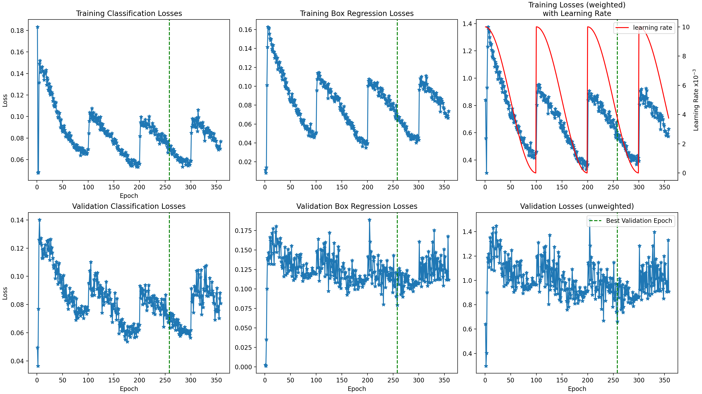

# Object Detection
The models in this repo were used during the completion of a PhD project looking at estimating
the size of the prostate using abdominal ultrasound images. 

A two-step approach was followed:

1. Detect the prostate and bladder.
2. Segment the prostate and bladder.

The results of the detection step were fed into the segmentation step to substantially 
improve the segmentation results. This repo contains the setup for training and testing/validating 
the object detection models. The segmentation setup can be found [here].

## Object Detection Models
Three object detection models were trained, tested, validated, and compared:

1. YOLO (not included yet): Not sure if I will include this as it has its own pipeline.
2. FasterRCNN: Use `train_fasterrcnn.py` to train and validate a faster rcnn model using a
Resnet50 FPN backbone (version 2).
3. RetinaNet: Use `train_retinanet.py` to train and validate a retinanet model using a
Resnet50 FPN backbone (version 2).

## Repo contents
The packages in this repo were created under the assumption of prostate and bladder detection,
however, minor modifications should allow for other types of object detection.

1. Datasets:
   - `ProstateBladderDataset.py`: Dataset class for the prostate and bladder ultrasound dataset.
   It is assumed that the bounding boxes are in YOLO format, that is: normalised 
   (x_centre, y_centre, width, height), which needs to be converted if training either the 
   RetinaNet or FasterRCNN models. It is important to note that FasterRCNN uses class label 0
   to represent the background, while RetinaNet and YOLO use class label 0 to represent
   a foreground object. The `display_transforms()` method of the class can be used to validate
   image transforms and subsequent bounding box transforms, but just because the transforms are
   being applied correctly does not mean the correct label 0 is set. If there are problems
   with validation images not showing all classes it may be due to an incorrect label 0.

2. DetectionModels:
   - `FasterRCNN.py`: Makes use of the `fasterrcnn_resnet50_fpn_v2` model with no pretrained 
   weights and a slightly altered forward pass. If the model is in evaluation mode and 
   targets are given then both the losses and the detections are returned (this is to enable 
   validation during training to prevent possible overfitting).
   - `RetinaNet.py`: Makes use of the `retinanet_resnet50_fpn_v2` model with no pretrained 
   weights and a slightly altered forward pass. If the model is in evaluation mode and 
   targets are given then both the losses and the detections are returned (this is to enable 
   validation during training to prevent possible overfitting).
   - I think these two classes have been set up correctly, but I am not entirely sure.

3. EarlyStopping:
   - `EarlyStopping.py`: Class that checks for improvements in validation set during training.
   If no improvement is detected after a set number of epochs, training is terminated. The
   minimum improvement necessary for continued training is defined by a delta value and the
   total number of training epochs without improvement before training is stopped is set by
   the patience value. The latest model as well as the best model are both saved, with the
   option of disabling saving of the latest model. Model saving also occurs in this class.

4. Transforms:
   - `Transformers.py`: Contains the training transforms and the validation transforms. Can
   be altered as desired.

5. Utils:
   - `ArgsParser.py`: Argument parser using by the training scripts. The default values have
   been set with my initial dataset in mind, so they may need to be changed when calling the 
   respective training script. Paths to training images, training labels, validation images, 
   and validation labels are necessary inputs. The rest have default options.
   - `Utils.py`: Extra functions used by training scripts. Loss plotting and final validation
   results plotting are available.

6. `job_fasterrcnn_training.sh` + `job_retinanet_training.sh`:
HPC job scripts used to call relevant training scripts.

7. `train_fastterrcnn.py` + `train_retinanet.py`:
Training scripts for fasterrcnn and retinanet models.

## Sample Model Results
The image below shows some sample losses from a FasterRCNN run using mostly default parameters,
except the oversampling_factor was set to 4 in an attempt to increase training dataset
diversity. Note the cos annealing with warm restarts learning rate and the green line indicating
the epoch with the best validation performance. The model saved under "best" will correspond
to the model at this point, while the model saved under "latest" will correspond to the model
from the last epoch run before early stopping kicked in.

